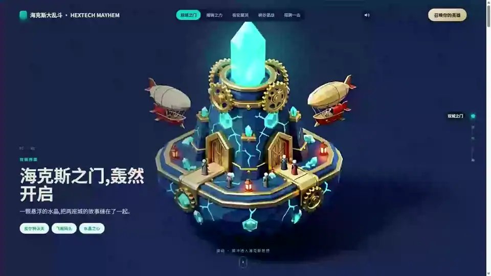
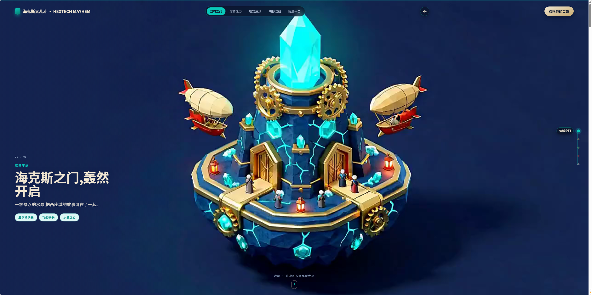

# 英雄联盟 · 海克斯大乱斗 — 滚动视频落地页

[English](README.en.md) | 简体中文

[](LICENSE)
[](https://github.com/oso95/scroll-world)
[](https://www.agnes-ai.com/)
[](https://jasonoracle.github.io/lol-scroll-video/)

> **在线体验:https://jasonoracle.github.io/lol-scroll-video/**

> 滚动鼠标,镜头从场景外一路俯冲进海克斯微缩世界,再无缝飞往下一个场景——
> 整个页面就是一段可以用滚轮来回"擦洗"的连续运镜。



**[▶ 观看完整演示视频](docs/demo.mp4)**(24 秒,含全部五个场景)



## 这个项目是怎么来的

有一天在抖音刷到一种"滚动视频网页"特效:滚动条成了时间轴,镜头随着滚动从场景外俯冲进场景内部,场景与场景之间没有任何剪辑痕迹,像一段专为鼠标滚轮拍摄的连续长镜头,非常惊艳。顺着特效找到了开源项目 [oso95/scroll-world](https://github.com/oso95/scroll-world),读完文档才发现它的默认流水线跑在 Higgsfield / Monid 这些付费服务上。

正好我手里有 [Agnes](https://www.agnes-ai.com/) 的免费生图(`agnes-image-2.5-flash`)和生视频(`agnes-video-2.5-flash`)模型 API——限时免费、质量够用,于是把这个项目改造成了**完全跑在 Agnes 上的版本**,并用它生成了这个「英雄联盟 · 海克斯」主题的演示页:五座海克斯微缩岛,从双城之门一路滚到超究极死神鲨弹升空。

**所有画面均由 AI 生成,零费用。**

## 页面里有什么

| 场景 | 内容 | 镜头 |
|---|---|---|
| 双城之门 | 海克斯之门全景,飞艇停泊 | 高空俯冲,齿轮开启露出水晶核心 |
| 熔铸之力 | 铁匠巨锤与水晶锻炉 | 俯冲入炉火,火花漂浮 |
| 祖安屋顶 | 鲨鱼火箭少女,绿汽弥漫 | 掠过屋顶,逼近炮口 |
| 峡谷混战 | 大桥团战定格,水晶弹幕悬空 | 低空穿越弹幕直抵交锋点 |
| 招牌一击 | 超究极死神鲨弹升空(终章 + CTA) | 迎着点火轨迹推近 |

5 张场景静图 → 5 段俯冲镜头 → 4 段无缝衔接镜头,共 9 段 720P 视频(约 48 MB),外加一个程序化触发的滚动擦洗引擎。

## 特性

- **帧锁定接缝** —— 每段衔接镜头的首尾帧取自相邻镜头渲染后的真实画面,接缝处再叠一层极短 crossfade,成片看不出剪辑点
- **纯静态、零依赖** —— 原生 JS 擦洗引擎自己构建 DOM/CSS,丢进任意静态托管就能跑,不挑框架
- **Blob 擦洗** —— 视频以 Blob 方式加载,不依赖 HTTP Range,任何静态服务器都能获得完整可拖动的 `seekable`
- **老机器自适配** —— 自动探测弱设备(CPU 核数 / 内存 / 现代语法支持):关粒子、关毛玻璃、收紧 seek 步长、卸载远处视频;**不牺牲视频清晰度**
- **默认开启的背景音乐** —— Web Audio 无缝循环,被浏览器自动播放策略拦截时任意首次交互自动补上;右上角喇叭可静音(仅当次访问)
- **深色海克斯主题** —— 页面级 CSS 覆盖引擎默认样式,并为老浏览器准备了逐级回退

## 快速开始

```bash
git clone https://github.com/JasonOracle/lol-scroll-video.git
cd lol-scroll-video
python -m http.server 8765
# 打开 http://localhost:8765/
```

> 需要通过 HTTP 访问(`file://` 直开会因跨域加载不了视频)。背景音乐(`assets/bgm.mp3`,18–32 秒切片)用于演示,**版权归原作者所有,侵删**;想换成自己的曲目,替换同名文件即可,页面会自动无缝循环播放。

## 想生成你自己的世界?

页面内容全部由 `index.html` 里的一份配置驱动(场景、文案、主题色、镜头节奏),素材由下面的流水线产生:

1. **写提示词** —— 每个场景一段"风格前言 + 主体描述",所有场景共用同一段风格前言,这是世界一致性的关键
2. **生成静图** —— Agnes 生图,16:9、4K,图生图锁定已通过的场景风格
3. **渲染镜头** —— 每个场景一段"俯冲入景"视频(keyframe 模式 + 首帧图)
4. **衔接镜头** —— 抽取相邻镜头的**真实首尾帧**,作为下一段视频的 `first_frame`/`last_frame`,让每个接缝逐像素对齐
5. **编码 + 组装** —— 帧内编码参数优化拖动体验,接缝 crossfade,配置接线

完整流水线脚本、资格探针(验证模型是否真的帧锁定)、以及大量踩坑记录,都在上游项目 [oso95/scroll-world](https://github.com/oso95/scroll-world) 的 skill 里;本仓库的 `scrub-engine.js` 与其同源,并额外加入了弱设备自适配与远端视频卸载。

### Agnes 接入要点(踩坑实录)

- `agnes-video-2.5-flash` 的 `keyframe` 模式接受 `first_frame`/`last_frame`,且**首帧真的是帧锁定**(实测 PSNR 25 dB/720p,构图逐像素对齐)
- 输出宽高比**跟随输入图**,`aspect_ratio` 参数不生效——想让镜头是 16:9,就喂 16:9 的图
- 帧图以 **base64 Data URI** 内联即可(≤1280w JPEG,约 200 KB),不需要图床
- 免费档**同时只允许一个视频任务**,并行提交第二个直接 429;生图也有频率限制,约 50 秒间隔可过
- 单段 720P 渲染 2–12 分钟不等,整条链务必后台跑 + 轮询

## 目录结构

```
├── index.html            # 页面 + 场景配置(文案/主题色/镜头节奏都在这)
├── scrub-engine.js       # 滚动擦洗引擎(与上游同源 + 弱机自适配/视频卸载)
├── hextech-bgm.js        # 背景音乐(Web Audio 无缝循环,默认开启)
├── assets/
│   ├── *.webp            # 5 张场景海报(Agnes 4K 图生图 → 2560w webp)
│   └── vid/*.mp4         # 9 段擦洗视频(Agnes 视频 keyframe 模式)
└── docs/screenshot.png   # 页面截图
```

## 致谢与声明

- [oso95/scroll-world](https://github.com/oso95/scroll-world) —— 本项目的上游与灵感来源,滚动擦洗引擎、接缝方法论和流水线设计都出自它(MIT)
- [Agnes AI](https://www.agnes-ai.com/) —— 免费的生图 / 生视频模型 API
- 本项目是**粉丝二创演示**,与 Riot Games 无关;League of Legends 及相关名称归 Riot Games 所有。请勿用于商业用途。

## License

[MIT](LICENSE) © 2026 JasonOracle
